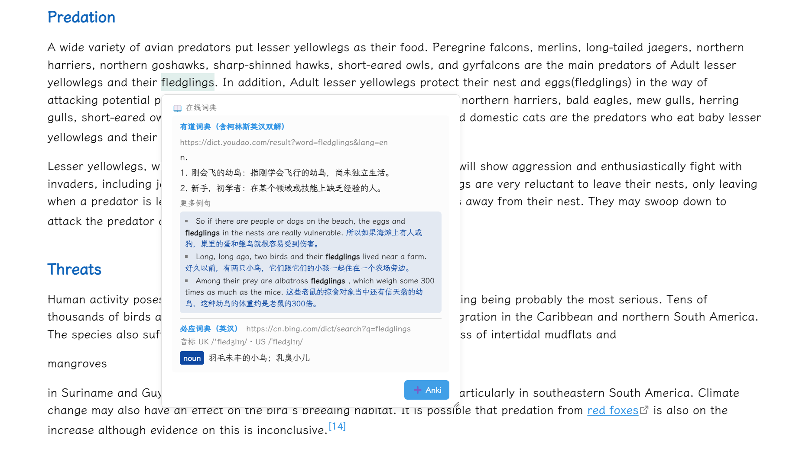

# Pick2anki

> Obsidian 划词词典插件：选中英文单词/短语 → 多源在线词典聚合释义 → 一键写入 Anki 生词卡。**无需任何 AI / 翻译 API Key。**

Pick2anki 为一条工作流设计：**在 Obsidian 里读英文资料 → 遇到生词划一下 → 释义进卡片 → 碎片时间用 Anki 复习**。查词与制卡都在当前笔记的上下文里完成，原句随词一起进卡。



---


## 功能

| 功能 | 说明 |
|------|------|
| 📖 **多源词典** | 划选英文单词/短语即弹出聚合释义，内置 5 个词典源：**有道（含柯林斯英汉双解授权数据）、柯林斯英汉双解官网、牛津高阶学习者词典、必应（英汉）、剑桥**。可启停、可排序；弹窗只完整展开排在最前且可用的 2 个源 |
| 🗂 **Anki 一键写卡** | 通过 **AnkiConnect** 直连本地 Anki（默认 `127.0.0.1:8765`），无需额外插件。写入指定牌组与笔记类型。 |
| 🧩 **字段映射（固定内容 → 你的模板）** | 插件固定提供 9 种内容：`单词/词组、原句笔记、发音音标、单一释义、全部释义、例句、额外信息、音频文件、来源地址`。读取你笔记类型的字段后，用下拉把每个内容指到你模板的字段；留空 = 不写入。同一字段被多个内容指向时自动合并 |
| 🔊 **发音** | 词典真人发音优先（英/美），失败自动用 **Edge TTS** 合成；音频经 AnkiConnect 存入 Anki 媒体库（`[sound:…]`），离线可播 |
| 📎 **语境与来源** | 自动截取当前笔记中含该词的原句；来源字段写入命中的词典链接与笔记链接 |

> 只处理英文单词/短语：中文、整段文字、超过 5 个词或 60 字符的选区不会触发查词。

## 安装

1. 从 Releases 下载 `main.js`、`manifest.json`、`styles.css`
2. 放入 `<vault>/.obsidian/plugins/pick-to-anki/`
3. 重启 Obsidian → 设置 → 第三方插件 → 启用 Pick2anki

## 使用

### 1. 划词查词

在笔记中划选英文单词/短语，弹窗显示多源聚合释义。默认直接划选触发；可在设置中改为 `Ctrl+划选` 触发，或调整防抖时间。

设置 →「在线词典」可调整**词典顺序与启停**，点"试查"验证网络连通。

> ⚠️ 柯林斯/牛津/剑桥等官网存在反爬或改版，失败时插件会自动跳过该源并继续其它源；**有道、必应最稳定**。普通词建议有道为主（含柯林斯英汉双解授权数据），生僻/技术词有道覆盖也最广。

### 2. 写入 Anki

前置：安装 **Anki 桌面版**并启用 **AnkiConnect** 插件（Anki → 工具 → 插件 → 获取插件，代码 `2055492159`）。

设置 →「Anki」：
1. 启用开关 →「测试连接并读取」获取牌组/笔记类型
2. 选择目标**牌组**（子牌组用 `::` 分隔）与**笔记类型**（切换时会自动读取其字段）
3. **字段映射**：为每个内容选择你模板中的字段（例如 `单词/词组 → Word`、`发音音标 → Phonetic`、`全部释义 → Definition`、`原句笔记 → Sentence`、`音频文件 → Audio`、`来源地址 → Source`），留空 = 该内容不写入
4. 可选：开启「查词后自动写卡」；设置重复卡片处理（跳过 / 仍然添加）、查重范围（牌组 / 整个笔记类型）、卡片标签

之后划词查词 → 弹窗点 **➕ Anki**（或命令面板执行「将选中文本加入 Anki」）。

## 架构

查词层按**适配器模式**拆分，一个词典源一个文件：

```
src/
├── main.ts              # 插件入口、命令、划词/弹窗
├── settings.ts          # 设置项与词典源/内容源常量
├── dict-types.ts        # 统一规范：DictResult / DictDefinition / DictAdapter
├── online-dict.ts       # 适配器注册表：并发查词、聚合、渲染、Anki 字段提取
├── youdao-dict.ts       # 有道（含 collins_primary 柯林斯双解解析）
├── collins-dict.ts      # 柯林斯英汉双解官网
├── oxford-dict.ts       # 牛津高阶学习者词典（英英）
├── bing-dict.ts         # 必应词典（英汉）
├── cambridge-dict.ts    # 剑桥词典
├── edge-tts.ts          # Edge TTS 合成发音
├── anki.ts              # AnkiConnect 客户端：牌组/字段读取、音频上传、写卡
├── dict-html.ts / dict-render.ts / dict-utils.ts
└── ...
```

所有源都输出同一结构（见 `src/dict-types.ts`），渲染、写卡、排序只依赖该规范：

```ts
interface DictDefinition {
  pos?: string; meaning: string; zh?: string;
  example?: string; exampleZh?: string;
}
interface DictResult {
  word: string; phonetic?: string;
  audioUrl?: string | { uk?: string; us?: string };
  definitions: DictDefinition[];      // 至少一条，否则适配器返回 null 走合成
  examples?: { en: string; zh?: string }[];
  source: string; sourceUrl?: string;
  extras?: string[]; raw?: unknown;
}
```

**接入新词典源**：实现一个 `DictAdapter`（`lookup()` 抓取并返回 `DictResult`，查无/失败返回 `null`），在 `online-dict.ts` 的 `DICT_ADAPTERS` 追加一项，设置页即自动出现：

```ts
import type { DictAdapter } from "./dict-types";
export const myAdapter: DictAdapter = {
  id: "mySource", name: "我的词典",
  sourceUrlFor: (w) => `https://example.com/${w}`,
  async lookup(word) { /* 抓取 → DictResult；失败返回 null */ },
};
```

##  开发

```bash
npm install          # 安装依赖
npm run build        # tsc 类型检查 + esbuild 打包 → main.js
npx eslint src       # lint
```

**Tech Stack:** TypeScript · esbuild · Obsidian API (`requestUrl` / DOM) · AnkiConnect (JSON-RPC over HTTP) · Edge TTS (WebSocket)

## 📄 License

MIT © soyami

致谢：
- `edge-tts.ts` 与部分样式改编自 [wjzixi/kuaifanyi](https://github.com/wjzixi/kuaifanyi)（MIT，Copyright © 2026 BOSS）
- 交互与界面设计参考 [ninja33/ODH (Online Dictionary Helper)](https://github.com/ninja33/ODH)（MIT，Copyright (c) 2018 Zhenyu Huang）
